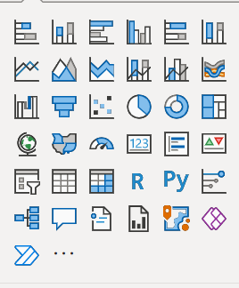

<link rel="stylesheet" href="style.css">

# Introduction  <!-- omit in TOC -->

## Contents <!-- omit in TOC -->

- [Advanced Analytics](#advanced-analytics)
- [Typical Architecture](#typical-architecture)
  - [Data Lake: Azure Data Lake Storage Gen2](#data-lake-azure-data-lake-storage-gen2)
  - [Data Warehouse: Azure Synapse SQL Pool](#data-warehouse-azure-synapse-sql-pool)
  - [ETL tools: Azure Synapse or Data Factory](#etl-tools-azure-synapse-or-data-factory)
  - [Anaytical tools: PowerBI](#anaytical-tools-powerbi)
- [Additional Resources](#additional-resources)
- [References](#references)
- [Agenda](#agenda)

## Advanced Analytics

With the term Advanced Analytics we refer to the capacity to integrate and synthesize complex data, in simple and user-friendly visual tools, or even static files or presentations. 
Analytical tools include capabilities to send alerts in case of abnormal data, or even automatize some operational process.

Some examples:
  - reivew sales data over the years,
  - quickly alert in case of products going out of stock, possibly sending directly a new order,
  - analyze social media interactions and chat exchanges with support in order to detect main complaints from customers

*From: Luke Chesser*

Complex analytics solutions retrieve data from databases and logs of one or more business applications, user files, output of Machine Learning applications, or even the Web (via web scraping) or public CSV files.

In our lesson we will focus on analyzing data from a single relational database.

There are different challenges in an analytical solution, that may be tackled by different people in an enterprise.
* Define a simple analytical model, that hides the complexity of a full operational model, and simplify the creation of visuals. The most used model in this context is the **star schema**: we will detail it in next chapters.
* Create visuals (like plots, cards or text)  based on the analytical model, that present in a simple and immediate way information that final users need.
* Manage a technical architecture that ensures good performances, data quickly available, fault tolerance, effective error analysis, data security.

## Typical Architecture

A typical architecture for an analytical solution with Azure tools is composed of several components, that we will analyze in this chapter.

Azure released in December 2020 a new tool called Azure Synapse, that provides a unified interface for managing different components of an analytical architecture. We will mention it in the following steps.

### Data Lake: Azure Data Lake Storage Gen2

A Data Lake is a simple file-system-like storage, that contains files organized in directories. Usually it contains files in tabular format (CSV, Parquet) or structured (JSON, XML), but can contain also txt, images or any other format.

It is used as a *staging* space, where data from external sources are retrieved "as is", before being converted into a specific analytical model.

Modern architectures exploit this intermediate staging space for several reasons, including the ability to test and adapt transformation stages without burdening the original data sources.

A Data Lake can be created within Azure portal, creating a container in an Azure Storage resource, or as an additional component while instantiating an Azure Synapse resource.

https://docs.microsoft.com/en-us/azure/storage/blobs/data-lake-storage-introduction

### Data Warehouse: Azure Synapse SQL Pool

A Data Warehouse is a SQL-like storage that contains data in an analytical model, typically a simplification of complex relational models of operational databases.

 The most used model in this context is the **star schema**. It has several characteristics:
  * It contains a main *fact* table, that contains measures that needs to be analyzed: quantity of sales, earning, employee salary...
  * It contains multiple tables that contain the *dimensions* on which the data can be analyzed (sales date, city, customer...)
  * Simplifies the original database, keeping only relevant information and normalizing data. 

Azure Synapse provides two types of Data Warehouse, that we will detail in our presentation: Serverless and Dedicated SQL Pool.

### ETL tools: Azure Synapse or Data Factory

An ETL pipeline is a series of steps defined to extract and trasform data from external sources. In Analytical solutions, they are used to copy data into the Data Lake, and then transform them into target analytical model.

ETL processes typically operate in two ways:

* Batch: schedule the ETL process regularly (once in an hour, day or week).
* Streaming: when real-time data are needed. The ETL process runs as soon as new data arrive.

In this presentation we concentrate on the first mode.

There are several ways to implement ETL pipelines: graphical tools, Python or other languages scripts: Jupyter Notebook are a common choice. Big Data tools such as Spark can be used according to the volume of data. 

In Azure, ETL Pipelines can be defined within a specific component of Synapse, or using an alternative resource, Azure Data Factory. The interfaces are very similar and both provide graphical tools to define pipelines.

### Anaytical tools: PowerBI

PowerBI is a tool to create Visual Reports from external data, and activate notifications and alerts.
Potentially it can retrieve data from different sources (Excel files, Databases...).

Indeed, for small projects it can be directly attached to operational databases. However, for a complex project it is always better to create an architecture with a Data Lake / Data Warehouse, and attach PowerBI to the Data Warehouse.

Once data are retrieven from a source, they can be shown in a tabular model, and relations between tables can be added by the user.

When tabular model is available, Dashboard pages can be created, adding plots, tables and text, providing for each component which column(s) to use.

## Additional Resources

There are several Microsoft resources that are often used to enrich the Advanced Analytics pipeline, according to the user needs.

- **IoT and Streaming** Azure provides resources to analyze Data coming from IoT sensors (analyze temperatures, movements, photos), and in general to process *real-time* data. We will see these tools in a next course
- **Logic Apps, Power Automate**: No-code tools that allows to create automated processes. E.g:  when a file is added to a given directory, for instance a CV, add an entry to a database and send a notification e-mail.
- **Azure Functions**: An Azure function is simply a function coded as a REST Endpoint. Azure provides libraries to code it in a simple way. It can be useful to do complex analysis or as an adapter to connect to external systems.
- **Cognitive Services, Azure Machine Learning**: often Machine Learning tools are used to enrich Data Ingestion pipelines. In future lessons we present the Cognitive Services resources and the Azure Machine Learning Studio.
- **Azure Databricks**: data analysis and transform tool based on Apache Spark. Typically used when complex analysis (e.g. Machine Learning) on large quantities of data are required. Unlike Data Factory, it does not provide a graphical interface but it requires writing codes with Jupyter notebooks.

We provide in the references some pointers for other interesting resources not covered in this course.

## References

Data Ingestion pipeline:
- https://docs.microsoft.com/en-us/azure/architecture/reference-architectures/data/enterprise-bi-adf
- https://docs.microsoft.com/en-us/azure/data-factory/
- https://docs.microsoft.com/en-us/azure/storage/blobs/data-lake-storage-introduction
- https://aka.ms/synapse

PowerBI:
- https://docs.microsoft.com/it-it/power-bi/

Other tools:
- https://docs.microsoft.com/en-us/azure/logic-apps/
- https://docs.microsoft.com/en-us/azure/azure-functions/
- https://docs.microsoft.com/en-us/azure/databricks/

Real time processing:
- https://docs.microsoft.com/en-us/azure/stream-analytics/
- https://docs.microsoft.com/en-us/azure/event-hubs/

Internet of Things:
- https://docs.microsoft.com/en-us/azure/iot-hub/
- https://docs.microsoft.com/en-us/azure/iot-edge/

## Agenda

1. [Presentation](01.presentation.md) :clock12: **(00:00)**
2. **[Introduction](02.introduction.md)** :clock1230: **(00:30)**
3. [Azure Synapse](03.azure-synapse.md) :clock130: **(01:30)**
4. Q&A :clock2: **(02:00)**