# Azure Synapse  <!-- omit in TOC -->

## Contents <!-- omit in TOC -->

- [General information](#general-information)
- [Demo](#demo)
  - [Create resources on Azure](#create-resources-on-azure)
  - [Create a copy job from an external source to a Data Lake](#create-a-copy-job-from-an-external-source-to-a-data-lake)
  - [Create a Data Warehouse and a dimensional model.](#create-a-data-warehouse-and-a-dimensional-model)
  - [Create a Power BI workspace and connect Synapse to it](#create-a-power-bi-workspace-and-connect-synapse-to-it)
  - [Power BI](#power-bi)
- [Agenda](#agenda)

## General information

Synapse Studio is an integrated Azure tool that allows managing all the steps of an Analytics pipeline, within a single interface.

In particular it integrates:
- A tool for designing ETL pipelines, [very similar to Azure Data Factory](https://docs.microsoft.com/en-us/azure/synapse-analytics/data-integration/concepts-data-factory-differences), with a graphical interface
- A tool to navigate the data in an Azure Data Lake Storage
- Two different ways to create a Data Warehouse:
  - a dedicated Relational Database (Dedicated SQL Pool)
  - a Serverless SQL Pool, i.e. a *logical* SQL Engine containing only views (or External Tables) on the Data Lake
- A connection to a PowerBI instance to see a preview of the reports.
- An interface to define Spark transformations using Jupyter Notebooks and run them on a cluster.

All the configuration and objects created within Synapse can be versioned with a Git repository.

## Demo

### Create resources on Azure

1. Create a resource group for your project
2. Open resource group, select Add --> MarketPlace --> Azure Synapse Analytics (**not private hubs**) --> Create
3. On the current screen, click on account name --> create new and select a name, same for file system name
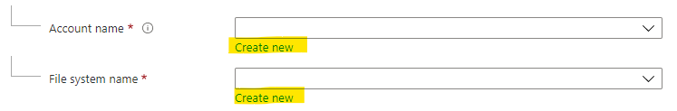

4. Add the remaining configuration for Synapse workspace as in the screenshot
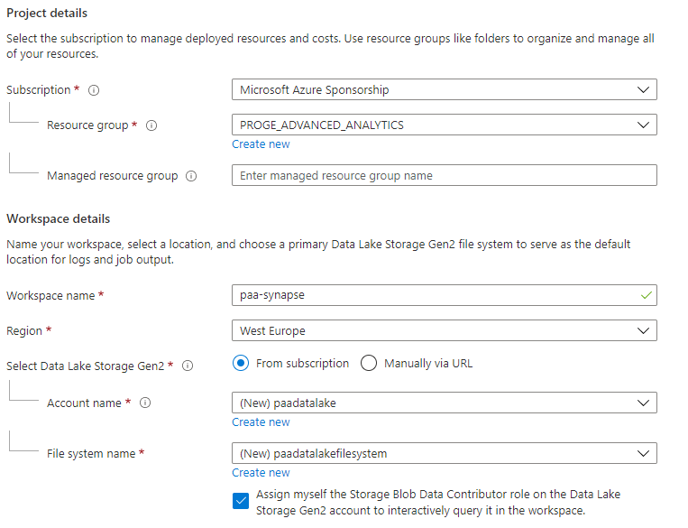

5. Click on review and create, then on Create
 
### Create a copy job from an external source to a Data Lake

1. Open the resource group of the project
2. Open Synapse Workspace
3. Click on *Open Synapse Studio*
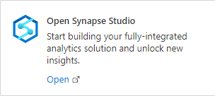

NB: Synapse allows you to version all the configurations in a GIT Repository. We won't go into details here, but you can switch between "Synapse Live" (no versioning) to a versioning in GIT in the upper left corner of the screen.
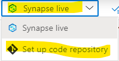

4. From Home Page, click on "Ingest"
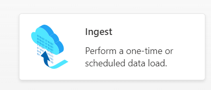

5. Select "Built-in copy task", then choose "Schedule" and define the frequency of the pipeline
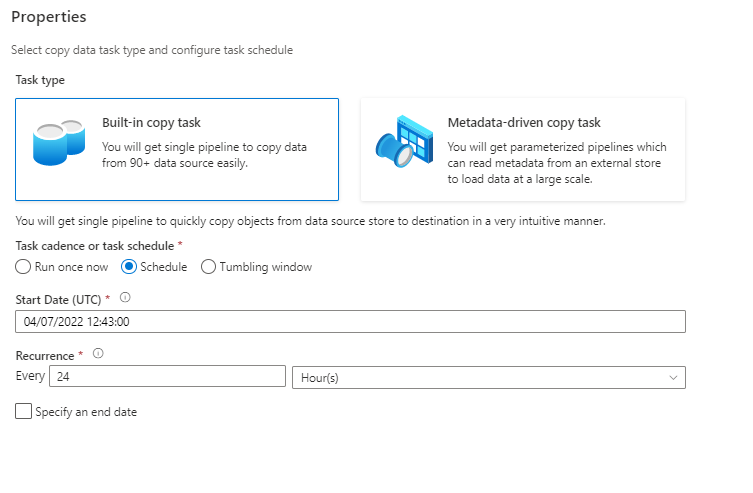

6. Define the data source, in this case an Azure SQL Database
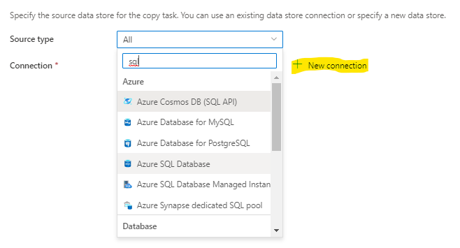

7. Provide all connection details and test the connection
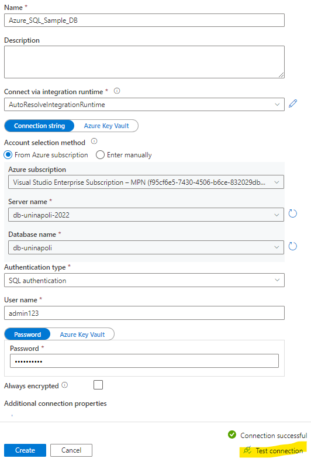

8. Select the tables to copy
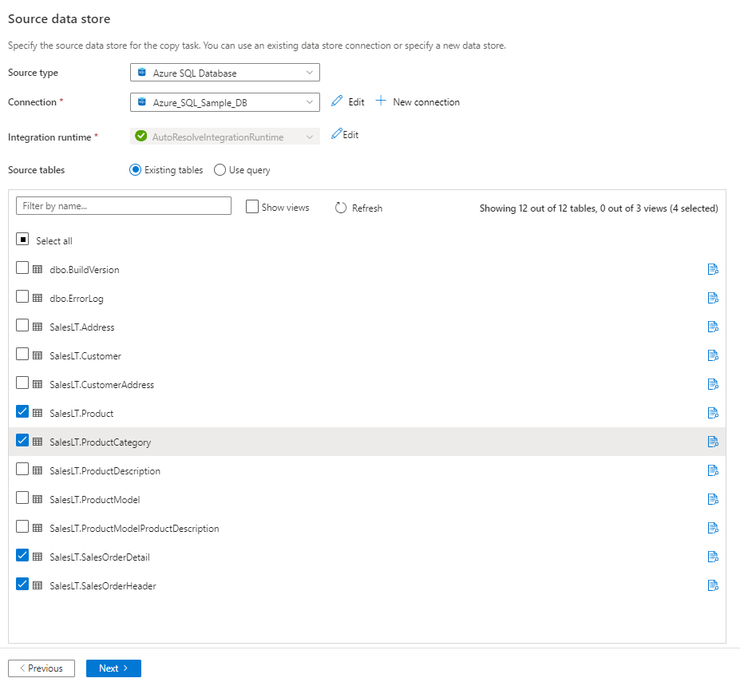

9. Define the Data Lake directory in which data will be copied
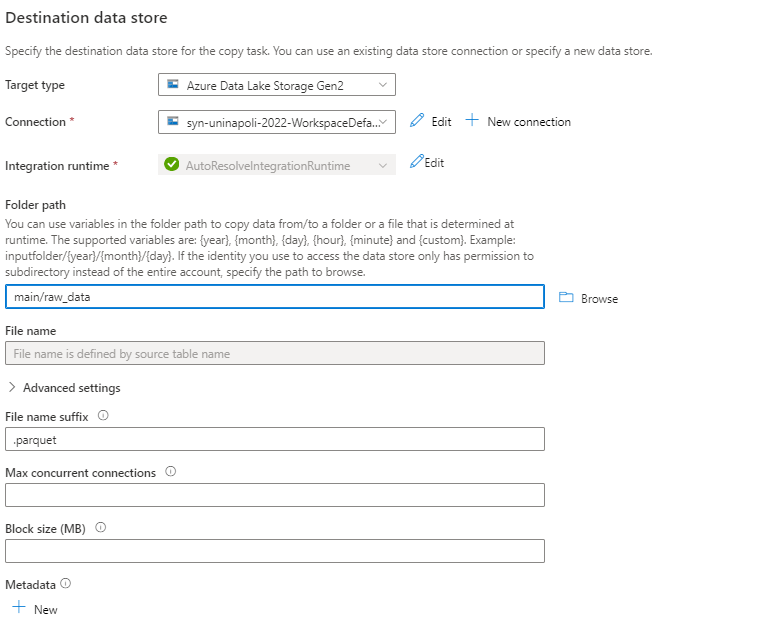

10. Provide the type of the target file: Parquet is an efficient format for tabular data
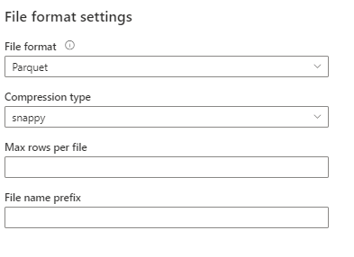

11.  Continue all the steps the click on Finish
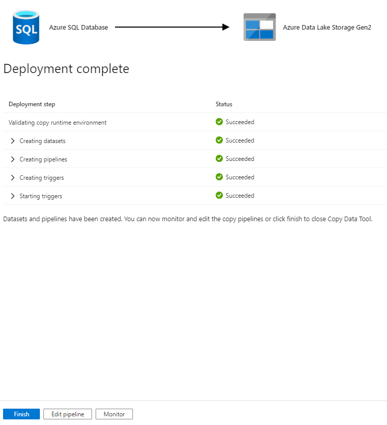

12. The pipeline is now completed and scheduled, and all connections needed (linked services) have been established. To see the details click on the Pipeline icon and see the created pipeline.
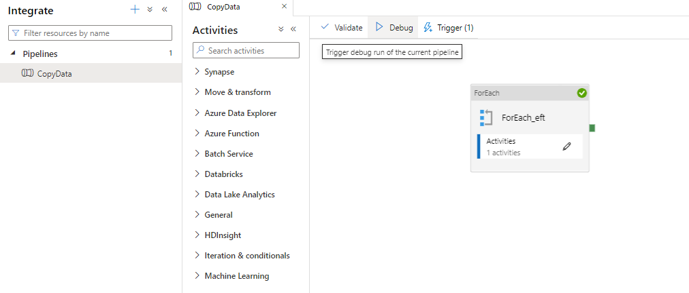

### Create a Data Warehouse and a dimensional model.

1. Click on the Database Icon, the on "+" sign to create a new Database
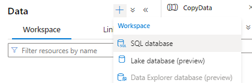

2. Select "Serverless" and provide a name, e.g.: dwh
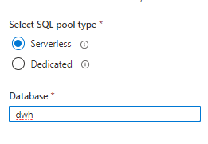

Now, we need to define the queries that transform the original data in a simplified analytical model. We want to reduce our 4 original tables into a star-schema of 1 main table (with quantity and price of orders) and 1 dimensional table (with information of the model). These queries will be wrapped in views that we will create on the Data Warehouse, and will point at the files in the data Lake.

3. Follow these steps to initiate a query on a file in the Data Lake. 
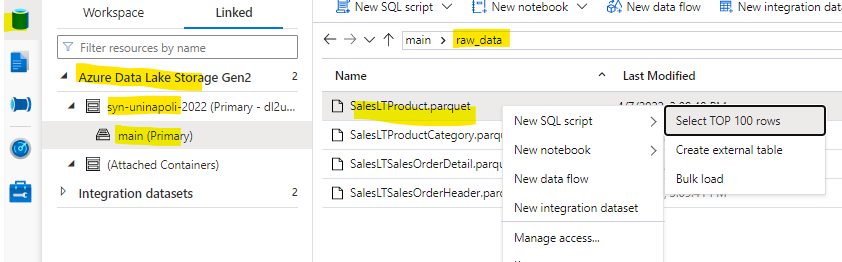

4. Select the dwh database
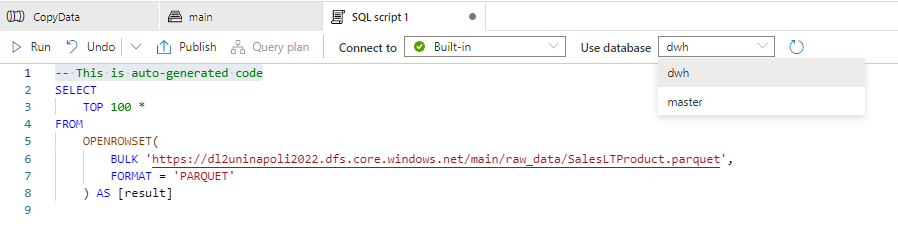

5. Write the views, give them a name and execute them
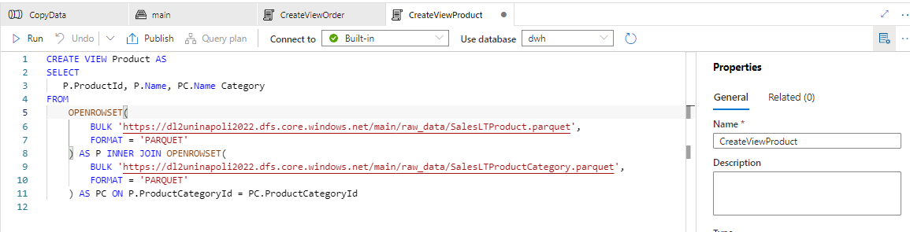
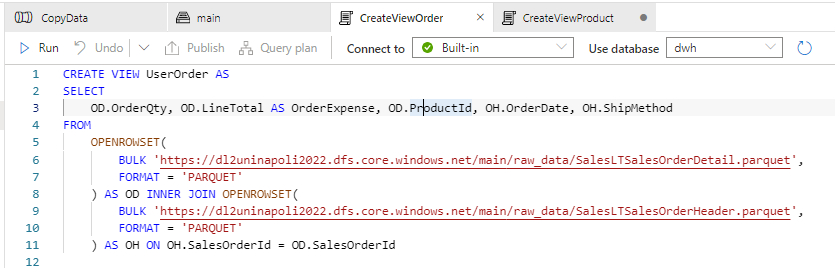

### Create a Power BI workspace and connect Synapse to it

1. Open [powerbi.com](https://app.powerbi.com/home)
2. Login with your own company account 
3. Click on workspaces --> Create a Workspace

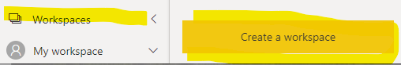

4. Provide name and description and click on save

5. Go back to Synapse, click on Manage --> Linked services --> New

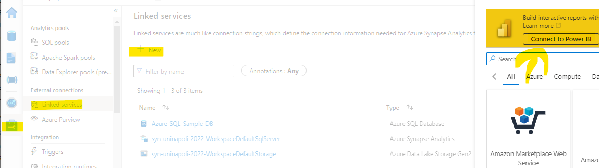

6. Select Connect to Power BI or search for Power BI
7. Provide a name for the linked service and the workspace name you have just created in Power BI, then click on Create
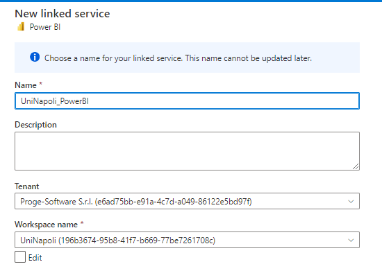

8. Click on Publish All to validate all modifications 
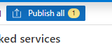

9. Follow these steps the download a file that contains the connection strings for the Data Warehouse.
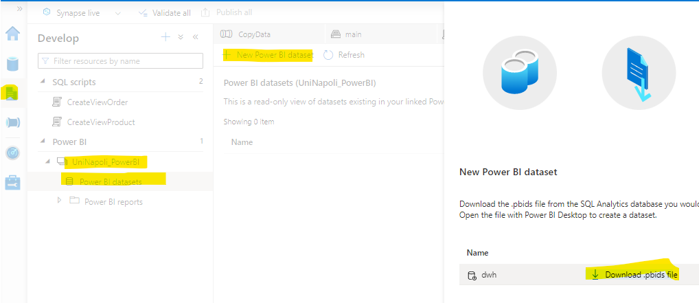

10. Open the file with PowerBI, and select both tables to load
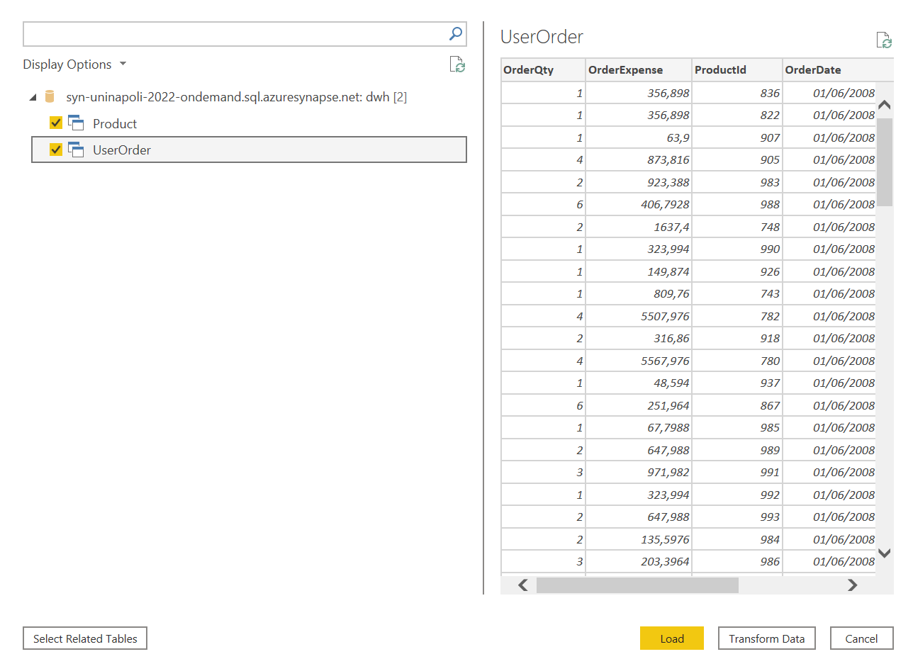

11. Select "Import" mode
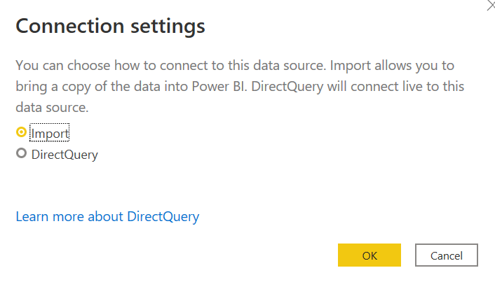

12. Start creating a report 
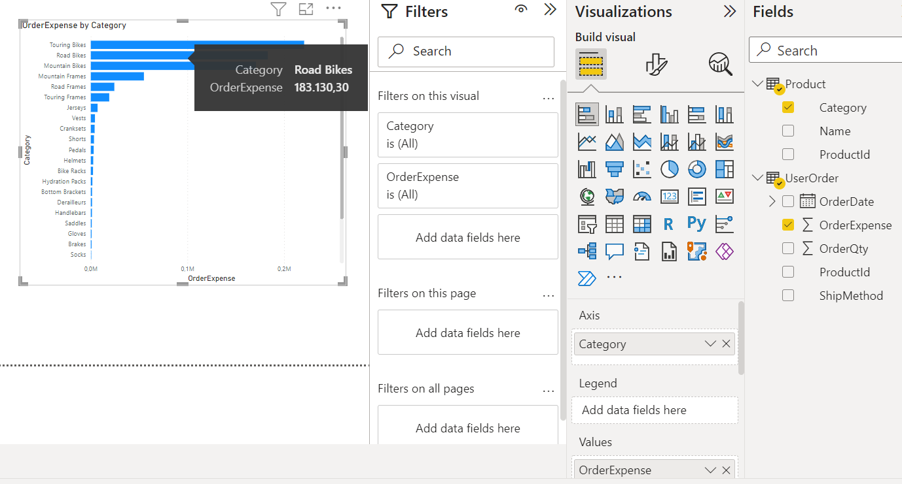

13. Save and publish on the dataset you just created
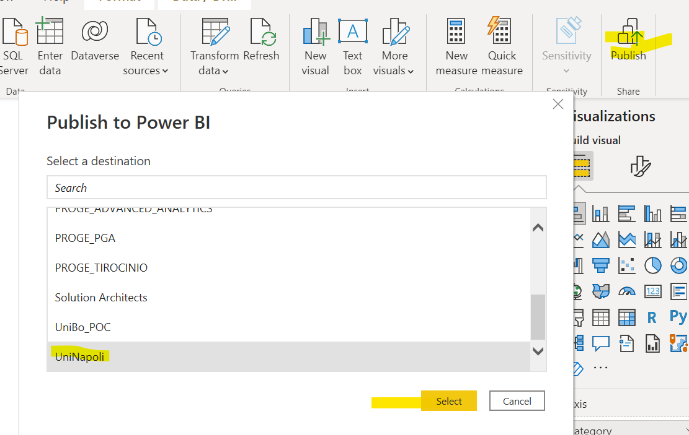

13. Open Synapse again: you will see the report you just created.
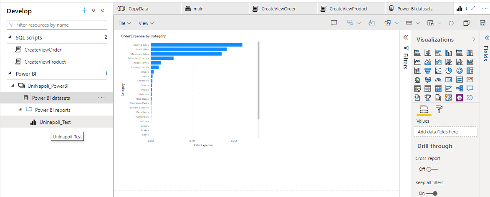

### Power BI

PowerBI desktop is a tool to create dynamic reports. It contains different interfaces:

1. Power Query interface to define how to load data
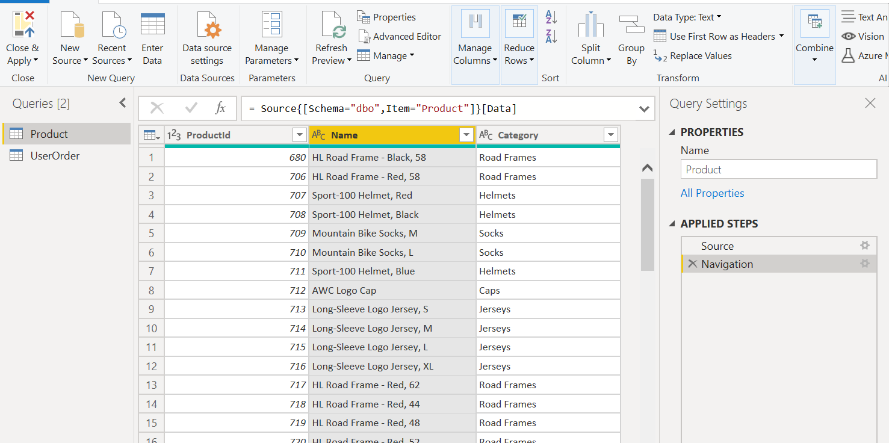

NB: for simple projects, you can directly use this interface to define an ETL-like pipeline.

2. The model and relationships of data you just loaded
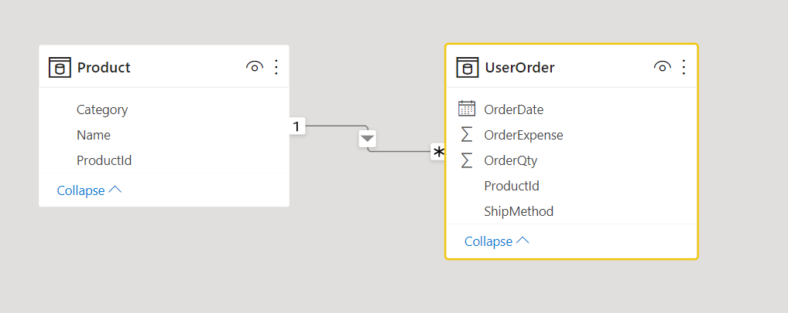

3. It is possible to define calculated columns and measures

4. It offers the possibility to create several kind of visuals
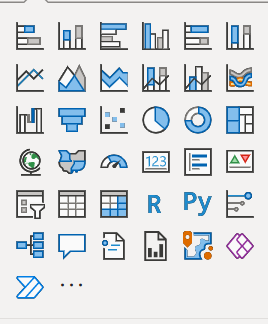

5. Reports created can be published on PowerBI Service, a SAAS platform to share and publish reports, with also the possibility to define alerts.
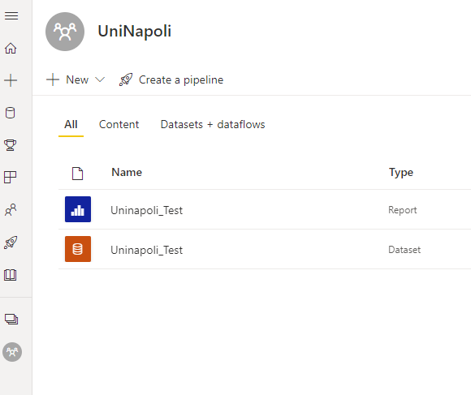

## Agenda

1. [Presentation](01.presentation.md) :clock12: **(00:00)**
2. [Introduction](02.introduction.md) :clock1230: **(00:30)**
3. **[Azure Synapse](03.azure-synapse.md)** :clock130: **(01:30)**
4. Q&A :clock2: **(02:00)**