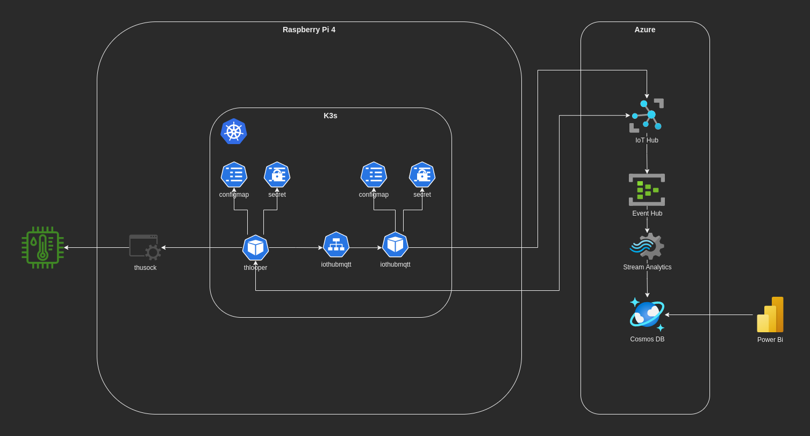

# Demo <!-- omit in toc -->

## Contents <!-- omit in toc -->

- [Architecture](#architecture)
- [Gateway](#gateway)
  - [Temp-Hum Sensor Sampler](#temp-hum-sensor-sampler)
    - [gRPC](#grpc)
    - [Unix Domain Socket](#unix-domain-socket)
  - [K3S](#k3s)
    - [THLooper](#thlooper)
    - [IoTHubMQTT Adapter](#iothubmqtt-adapter)
- [Azure](#azure)
  - [Azure IoT Hub](#azure-iot-hub)
  - [Azure Event Hub](#azure-event-hub)
  - [Azure Stream Analytics](#azure-stream-analytics)
  - [Azure CosmosDB](#azure-cosmosdb)
  - [Power Bi](#power-bi)

## Architecture

## Gateway

### Temp-Hum Sensor Sampler

DHT12

#### gRPC

#### Unix Domain Socket

### K3S

#### THLooper

#### IoTHubMQTT Adapter

## Azure

### Azure IoT Hub

### Azure Event Hub

### Azure Stream Analytics

### Azure CosmosDB

### Power Bi
