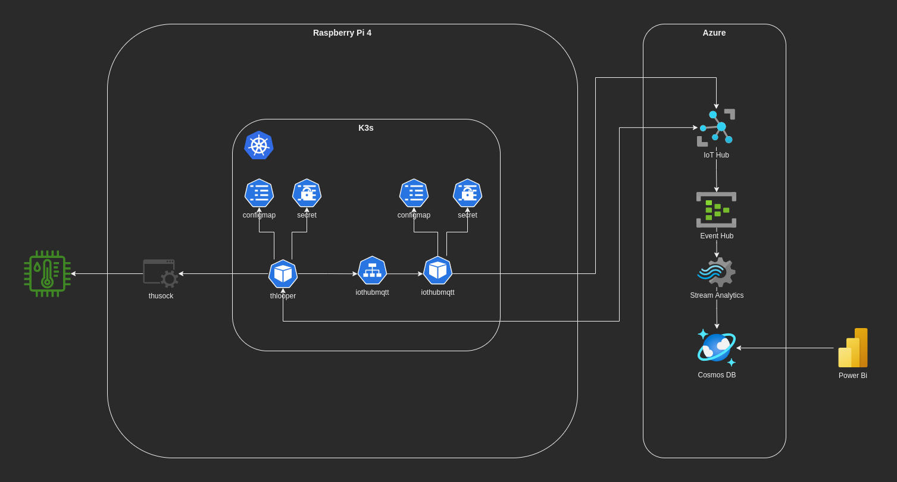
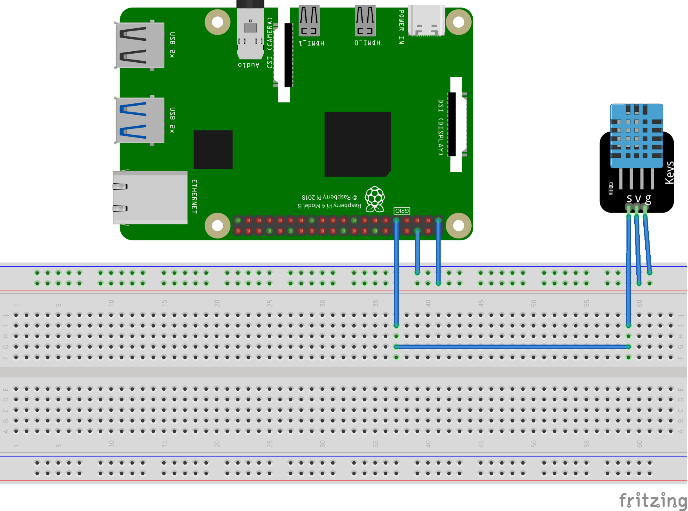
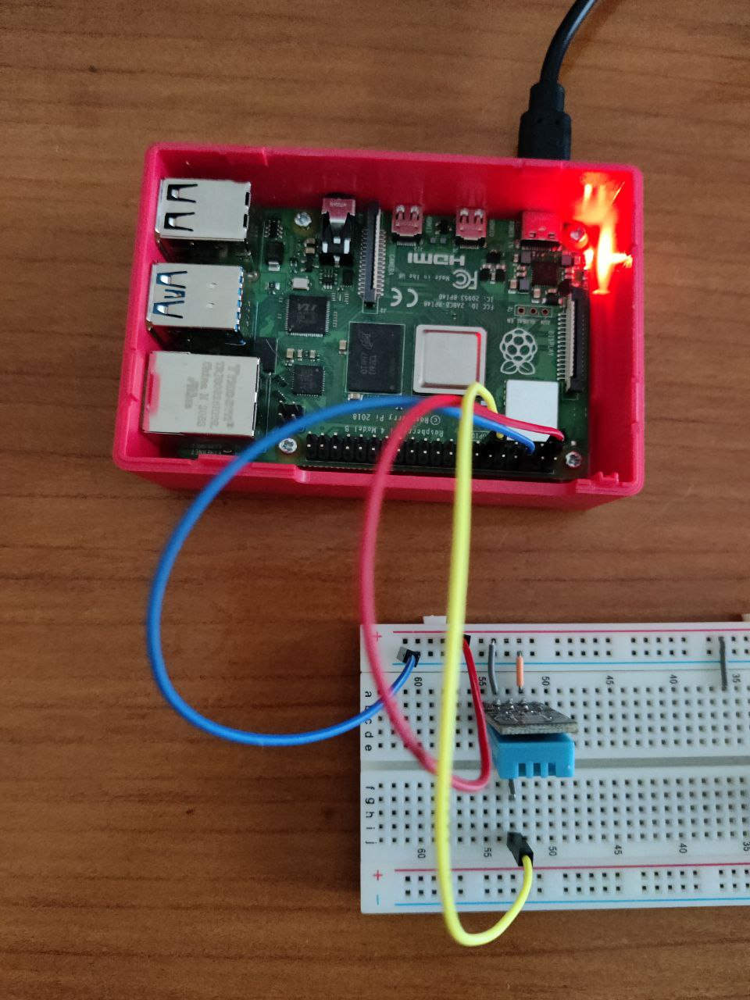
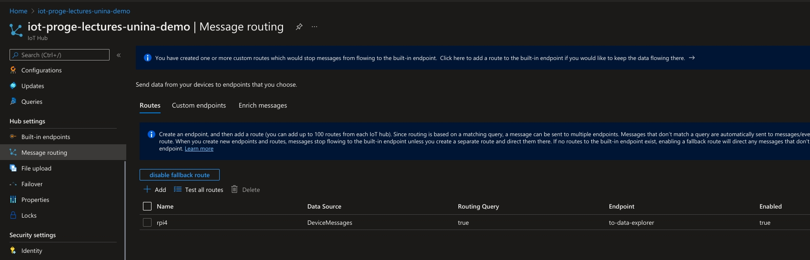
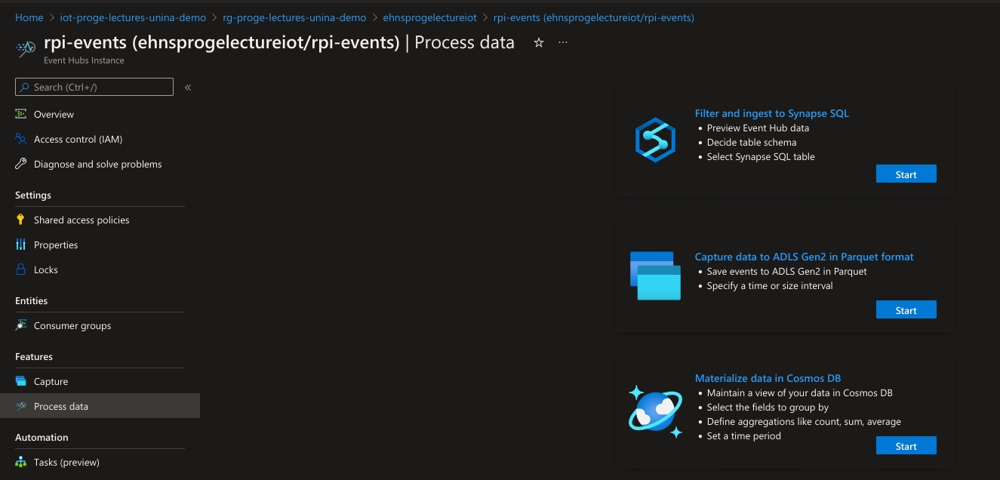
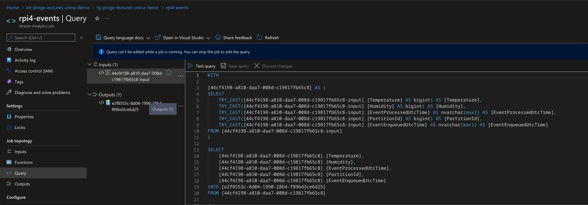
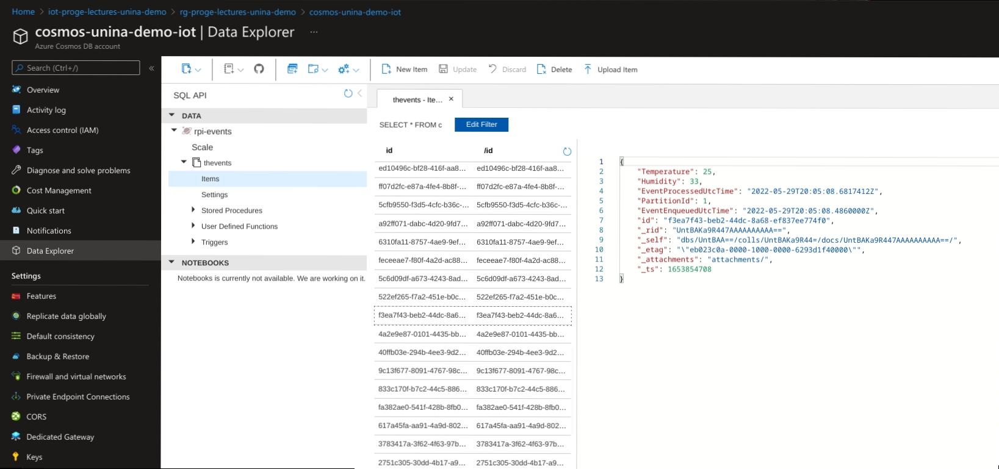

# Demo <!-- omit in toc -->

## Contents <!-- omit in toc -->

- [Architecture](#architecture)
- [Raspberry Pi 4](#raspberry-pi-4)
  - [Reading data from sensor](#reading-data-from-sensor)
    - [gRPC](#grpc)
    - [Unix Domain Socket](#unix-domain-socket)
  - [Systemd](#systemd)
  - [K3S](#k3s)
    - [Manifests](#manifests)
  - [Services](#services)
    - [THLooper](#thlooper)
    - [IoTHubMQTT](#iothubmqtt)
- [Azure](#azure)
- [References](#references)

## Architecture

The main idea is to sample Temperature and Humidity data using a DHT12 sensor and a Raspberry Pi 4, push them on an IoT Hub and process them leveraging on the services available on Azure, like Event Hubs, Stream Analytics, Cosmos DB.
Finally, plot them using a Power Bi dashboard.



## Raspberry Pi 4

We use a Raspberry Pi 4 as an IoT Gateway which is in charge of sampling data, send data to and handle the cloud-to-device messages from the Azure IoT Hub service.





### Reading data from sensor

To read temperature from the DHT12 sensor, a simple module in Go is used.
A gRPC server has been implemented to expose the functionality of data sampling and published on the machine using a Unix Domain Socket.

#### gRPC

gRPC is a modern open source high performance Remote Procedure Call (RPC) framework that can run in any environment.
It can efficiently connect services in and across data centers with pluggable support for load balancing, tracing, health checking and authentication.
It is also applicable in last mile of distributed computing to connect devices, mobile applications and browsers to backend services.

The gRPC server implements the following specification:

```proto
syntax = "proto3";
package thgrpc;

option optimize_for = LITE_RUNTIME;
option go_package = "github.com/filariow/thsock/pkg/thprotos";

// The Temperature-Service service definition.
service TempHumSvc {
    // Read Temperature and Humidity from sensor
    rpc ReadTempHum (ReadTempHumRequest) returns (ReadTempHumReply) {}
}

message ReadTempHumRequest {}
message ReadTempHumReply {
    double Temperature = 1;
    double Humidity = 2;
}
```

To build the skeleton, starting from the specification, you can use the following command (that you can also find as a rule in the [Makefile](./src/thsock/Makefile))

```sh
mkdir -p pkg/thprotos
protoc \
  -I protos \
  --go_opt=paths=source_relative \
  --go_out=pkg/thprotos \
  --go-grpc_opt=paths=source_relative \
  --go-grpc_out=pkg/thprotos \
  protos/*.proto
```

Finally, you can find the server implementation at [`src/thsock/internal/thgrpc/server.go`](./src/thsock/internal/thgrpc/server.go).

#### Unix Domain Socket

A Unix domain socket, aka UDS or IPC socket (inter-process communication socket), is a data communications endpoint for exchanging data between processes.

To be more precise, it's a way to talk to other computers using standard Unix file descriptors.
In Unix, every I/O action is done by writing or reading a file descriptor.
A file descriptor is just an integer associated with an open file and it can be a network connection, a text file, a terminal, or something else.

To a programmer, a socket looks and behaves much like a low-level file descriptor.
This is because commands such as read() and write() work with sockets in the same way they do with files and pipes.

You can refer to [`src/thsock/cmd/usock/main.go`](./src/thsock/cmd/usock/main.go) as an example of implementation.

```go
package main

import (
	"log"
	"net"
	"os"

	"github.com/filariow/thsock/internal/thgrpc"
	"github.com/filariow/thsock/pkg/thprotos"
	"google.golang.org/grpc"
)

const SockAddr = "/tmp/th.socket"

func main() {
	if err := run(); err != nil {
		log.Fatal(err)
	}
}

func run() error {
	log.Printf("Setting up socket file at '%s'\n", SockAddr)
	if err := os.RemoveAll(SockAddr); err != nil {
		return err
	}

	log.Printf("Listening on socket '%s'\n", SockAddr)
	ls, err := net.Listen("unix", SockAddr)
	if err != nil {
		return err
	}

	log.Println("Setting up gRPC server")
	s := grpc.NewServer()
	t := thgrpc.New()
	thprotos.RegisterTempHumSvcServer(s, t)

	log.Println("Startup process completed, waiting fpr gRPC requests...")
	return s.Serve(ls)
}
```

### Systemd

To start the gRPC server at system boot we relied on systemd.

systemd is a suite of basic building blocks for a Linux system. It provides a system and service manager that runs as PID 1 and starts the rest of the system.

systemd provides aggressive parallelization capabilities, uses socket and D-Bus activation for starting services, offers on-demand starting of daemons, keeps track of processes using Linux control groups, maintains mount and automount points, and implements an elaborate transactional dependency-based service control logic.

In systemd we registered and enabled the following [`service`](./src/thsock/deploy/usocksvc/usocksvc.service):

```ini
[Unit]
Description=Temperature Humidity socket service

[Service]
Type=simple
RemainAfterExit=no
ExecStart=thsock

[Install]
Alias=thsock
WantedBy=multi-user.target
```

### K3S

K3s is a highly available, certified Kubernetes distribution designed for production workloads in unattended, resource-constrained, remote locations or inside IoT appliances.

K3s is packaged as a single <50MB binary that reduces the dependencies and steps needed to install, run and auto-update a production Kubernetes cluster.

#### Manifests

On the raspberry an instance of K3s is installed and we published the services we developed to monitor the temperature and humidity into the place and send data on Azure.

The resources we create in the K3s cluster can be found in the [manifests folder](./src/thsock/manifests/).

### Services

#### THLooper

The THLooper is a module in charge of continuously reading data from the sensor relying on the previously described socket, that must be mounted into the container.
Whenever it retrieves information about temperature and humidity, it sends it to a service that is in charge of sending the data to the Azure IoT Hub.
This service is named [IoTHubMQTT](#iothubmqtt).

This module also handles by himself the cloud-to-device communication, subscribing on some MQTT topics exposed by IoT Hub that are used to send notifications about Module Twins `direct methods` and `desired properties`.

The code is available at [`src/thsock/cmd/thlooper/main.go`](src/thsock/cmd/thlooper/main.go).

#### IoTHubMQTT

The IoTHubMQTT service implements the device-to-cloud communication, exposing an HTTP server to the cluster that can be used to publish messages on IoT Hub using the MQTT protocol.

The code is available at [`src/thsock/cmd/iothubbroker/main.go`](src/thsock/cmd/iothubbroker/main.go).

## Azure


Once the data is in Azure IoT, we automatically forward them to an Azure Event Hub adding a dedicated route into the IoT Hub's section `Message routing`.



Similarly, on the Event Hubs we used the wizard `Materialize data in Cosmos DB` from the section `Process data`, to create a Stream Analytics that reads the data from the Event Hubs and materializes them into the Cosmos DB.





As a result we can find the data sent from the Raspberry Pi 4 into the Cosmos DB.



## References

- https://grpc.io/
- https://en.wikipedia.org/wiki/Unix_domain_socket
- https://www.tutorialspoint.com/unix_sockets/socket_quick_guide.htm
- https://systemd.io/
- https://wiki.archlinux.org/title/Systemd
- https://k3s.io/
