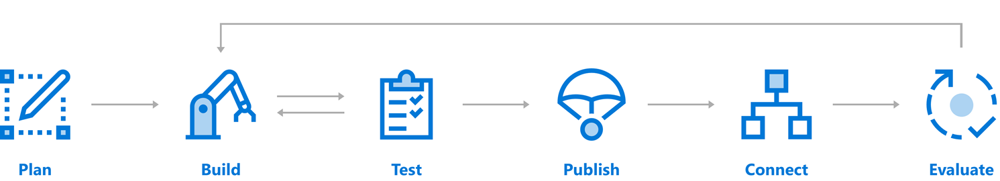

# Azure Bot <!-- omit in TOC -->

## Contents <!-- omit in TOC -->
- [Azure Bot Service](#azure-bot-service)
- [What is a bot?](#what-is-a-bot)
- [Building a bot](#building-a-bot)
    - [Plan](#plan)
    - [Build](#build)
    - [Test](#test)
    - [Publish](#publish)
    - [Connect](#connect)
    - [Evaluate](#evaluate)
- [Bot Framework SDK](#bot-framework-sdk)
- [References](#references)
- [Agenda](#agenda)

## Azure Bot Service
Azure Bot Service and Bot Framework provide tools to build, test, deploy, and manage intelligent bots, all in one place. Through the use of modular and extensible framework provided by the SDK, tools, templates, and AI services developers can create bots that use speech, understand natural language, handle questions and answers, and more.

## What is a bot?
Bots provide an experience that feels less like using a computer and more like dealing with a person - or at least an intelligent robot. They can be used to shift simple, repetitive tasks, such as taking a dinner reservation or gathering profile information, on to automated systems that may no longer require direct human intervention. Users converse with a bot using text, interactive cards, and speech. A bot interaction can be a quick question and answer, or it can be a sophisticated conversation that intelligently provides access to services.

A bot can be thought of as a web application that has a conversational interface. A user connects to a bot through a channel such as Facebook, Slack, or Microsoft Teams.

-The bot reasons about input and performs relevant tasks. This can include asking the user for additional information or accessing services on behalf of the user.
-The bot performs recognition on the user's input to interpret what the user is asking for or saying.
-The bot generates responses to send to the user to communicate what the bot is doing or has done.
-Depending on how the bot is configured and how it's registered with the channel, users can interact with the bot through text or speech, and the conversation might include images and video.

Bots are a lot like modern web applications, living on the internet and use APIs to send and receive messages. What's in a bot varies widely depending on what kind of bot it is. Modern bot software relies on a stack of technology and tools to deliver increasingly complex experiences on a wide variety of platforms. However, a simple bot could just receive a message and echo it back to the user with very little code involved. 

Bots can do the same things other types of software can do - read and write files, use databases and APIs, and do the regular computational tasks. What makes bots unique is their use of mechanisms generally reserved for human-to-human communication. 

Azure Bot Service and Bot Framework offer:
- Bot Framework SDK for developing bots
- Bot Framework Tools to cover end-to-end bot development workflow
- Bot Framework Service (BFS) to send and receive messages and events between bots and channels
- Bot deployment and channel configuration in Azure

Additionally, bots may use other Azure services, such as:
- Azure Cognitive Services to build intelligent applications 
- Azure Storage for cloud storage solution

## Building a bot 

Azure Bot Service and Bot Framework offer an integrated set of tools and services to facilitate this process. Choose your favorite development environment or command line tools to create your bot. SDKs exist for C#, JavaScript, and Typescript. (SDKs for Java and Python are under development.) We provide tools for various stages of bot development to help you design and build bots.

 

### Plan
As with any type of software, having a thorough understanding of the goals, processes and user needs is important to the process of creating a successful bot. Before writing code, review the bot [design guidelines](bot-service-design-principles.md) for best practices and identify the needs for your bot. You can create a simple bot or include more sophisticated capabilities such as speech, natural language understanding, and question answering.

### Build
Your bot is a web service that implements a conversational interface and communicates with the Bot Framework Service to send and receive messages and events. Bot Framework Service is one of the components of the Azure Bot Service and Bot Framework. You can create bots in any number of environments and languages. You can start your bot development in the [Azure portal](bot-service-quickstart.md), or use [[C#](dotnet/bot-builder-dotnet-sdk-quickstart.md) | [JavaScript](javascript/bot-builder-javascript-quickstart.md) | [Python](python/bot-builder-python-quickstart.md)] templates for local development.

### Test 
Bots are complex apps, with a lot of different parts working together. Like any other complex app, this can lead to some interesting bugs or cause your bot to behave differently than expected. Before publishing, test your bot. We provide several ways to test bots before they are released for use:

- Test your bot locally with the [emulator](bot-service-debug-emulator.md). The Bot Framework Emulator is a stand-alone app that not only provides a chat interface but also debugging and interrogation tools to help understand how and why your bot does what it does.  The emulator can be run locally alongside your in-development bot application. 
 
- Test your bot on the [web](bot-service-manage-test-webchat.md). Once configured through the Azure portal your bot can also be reached through a web chat interface. The web chat interface is a great way to grant access to your bot to testers and other people who do not have direct access to the bot's running code.

- [Unit Test](https://docs.microsoft.com/azure/bot-service/unit-test-bots) your bot with the July update of Bot Framework SDK.

### Publish 
When you are ready for your bot to be available on the web, publish your bot to [Azure](bot-builder-howto-deploy-azure.md) or to your own web service or data center. Having an address on the public internet is the first step to your bot coming to life on your site, or inside chat channels.

### Connect          
Connect your bot to channels such as Facebook, Messenger, Kik, Skype, Slack, Microsoft Teams, Telegram, text/SMS, Twilio, Cortana, and Skype. Bot Framework does most of the work necessary to send and receive messages from all of these different platforms - your bot application receives a unified, normalized stream of messages regardless of the number and type of channels it is connected to. For information on adding channels, see [channels](bot-service-manage-channels.md) topic.

### Evaluate 
Use the data collected in Azure portal to identify opportunities to improve the capabilities and performance of your bot. You can get service-level and instrumentation data like traffic, latency, and integrations. Analytics also provides conversation-level reporting on user, message, and channel data. For more information, see [how to gather analytics](bot-service-manage-analytics.md).

## Bot Framework SDK
The Bot Framework, along with the Azure Bot Service, provides tools to build, test, deploy, and manage intelligent bots, all in one place. The Bot Framework includes a modular and extensible SDK for building bots, as well as tools, templates, and related AI services. With this framework, developers can create bots that use speech, understand natural language, handle questions and answers, and more.
