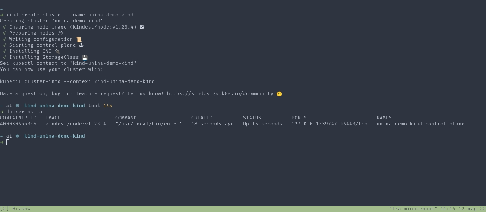

# Kubernetes <!-- omit in toc -->

## Contents <!-- omit in toc -->

- [Install Tools](#install-tools)
  - [kubectl](#kubectl)
  - [kind](#kind)
  - [Docker Desktop](#docker-desktop)
  - [Minikube](#minikube)
  - [k3s](#k3s)
- [Managed instances](#managed-instances)
  - [AKS](#aks)
- [Demo](#demo)
  - [Create a local cluster for development with kind](#create-a-local-cluster-for-development-with-kind)
- [Kubernetes Components](#kubernetes-components)
  - [Control Plane](#control-plane)
    - [kube-apiserver](#kube-apiserver)
    - [etcd](#etcd)
    - [kube-scheduler](#kube-scheduler)
    - [kube-controller-manager](#kube-controller-manager)
    - [cloud-controller-manager](#cloud-controller-manager)
- [Kubernetes Objects](#kubernetes-objects)
  - [Namespaces](#namespaces)
    - [Demo](#demo-1)
  - [Pods](#pods)
    - [Demo](#demo-2)
  - [Service](#service)
  - [Volumes](#volumes)
  - [ConfigMaps](#configmaps)
  - [Secrets](#secrets)
- [References](#references)
- [More Links](#more-links)

## Install Tools

### kubectl

The Kubernetes command-line tool, kubectl, allows you to run commands against Kubernetes clusters.
You can use kubectl to deploy applications, inspect and manage cluster resources, and view logs.

### kind

kind is a tool for running local Kubernetes clusters using Docker container “nodes”.
kind was primarily designed for testing Kubernetes itself, but may be used for local development or CI.

### Docker Desktop

Docker Desktop includes a standalone Kubernetes server and client.
The Kubernetes server runs locally within your Docker instance, is not configurable, and is a single-node cluster.

### Minikube

minikube is local Kubernetes, focusing on making it easy to learn and develop for Kubernetes.

### k3s

K3s is a highly available, certified Kubernetes distribution designed for production workloads in unattended, resource-constrained, remote locations or inside IoT appliances.

Both ARM64 and ARMv7 are supported with binaries and multiarch images available for both. K3s works great from something as small as a Raspberry Pi to an AWS a1.4xlarge 32GiB server.

## Managed instances

Kubernetes clusters are available as managed instances from all major cloud providers, like Azure, GCP, AWS, etc.

### AKS

Azure Kubernetes Service (AKS) simplifies deploying a managed Kubernetes cluster in Azure by offloading the operational overhead to Azure.
As a hosted Kubernetes service, Azure handles critical tasks, like health monitoring and maintenance.
Since Kubernetes masters are managed by Azure, you only manage and maintain the agent nodes.
Thus, AKS is free; you only pay for the agent nodes within your clusters, not for the masters.

## Demo

### Create a local cluster for development with kind

In this demo we are going to create a local kubernetes cluster with kind.
First of all you must have installed `kind` and its dependencies on your pc.

Then it is as simple as running:

```bash
kind create cluster --name unina-demo-kind
docker ps -a
```



## Kubernetes Components

A Kubernetes cluster consists of a set of worker machines, called nodes, that run containerized applications. Every cluster has at least one worker node.

The worker node(s) host the Pods that are the components of the application workload. The control plane manages the worker nodes and the Pods in the cluster.
In production environments, the control plane usually runs across multiple computers and a cluster usually runs multiple nodes, providing fault-tolerance and high availability.


### Control Plane

The control plane's components make global decisions about the cluster (for example, scheduling), as well as detecting and responding to cluster events (for example, starting up a new pod when a deployment's replicas field is unsatisfied).

#### kube-apiserver

The API server is a component of the Kubernetes control plane that exposes the Kubernetes API.
The API server is the front end for the Kubernetes control plane.

#### etcd

Consistent and highly-available key value store used as Kubernetes' backing store for all cluster data.

#### kube-scheduler

Control plane component that watches for newly created Pods with no assigned node, and selects a node for them to run on.

#### kube-controller-manager

Control plane component that runs controller processes.
Controllers are control loops that watch the state of your cluster, then make or request changes where needed. Each controller tries to move the current cluster state closer to the desired state.

#### cloud-controller-manager

A Kubernetes control plane component that embeds cloud-specific control logic.
The cloud controller manager lets you link your cluster into your cloud provider's API, and separates out the components that interact with that cloud platform from components that only interact with your cluster.

## Kubernetes Objects

### Namespaces

Namespaces provides a mechanism for isolating groups of resources within a single cluster.
Names of resources need to be unique within a namespace, but not across namespaces.

#### Demo

```bash
# create namespace
kubectl create namespace unina-demo

# set 'unina-demo' default namespace (see also https://github.com/ahmetb/kubectx)
kubectl config set-context --current --namespace unina-demo
```

### Pods

Pods are the smallest deployable units of computing that you can create and manage in Kubernetes.

A Pod (as in a pod of whales or pea pod) is a group of one or more containers, with shared storage and network resources, and a specification for how to run the containers.

#### Demo

```bash
# create a pod
cat << EOF | kubectl apply -f -
apiVersion: v1
kind: Pod
metadata:
  name: nginx
  labels:
    app: nginx
spec:
  containers:
  - name: nginx
    image: nginx:latest
    ports:
    - containerPort: 80
      name: http-web-svc
EOF

# watch pod
kubectl get pod -w nginx

# when status changes in 'Running', interrupt with Ctrl+C and bind pod's port on localhost
^C
kubectl port-forward pod/nginx 8080:80

# navigate http://localhost:8080 and you will have the page served by the pod
```

### Service

An abstract way to expose an application running on a set of Pods as a network service.

In Kubernetes, a Service is an abstraction which defines a logical set of Pods and a policy by which to access them.
The set of Pods targeted by a Service is usually determined by a selector.

```bash
# create the service for the pod previously created
cat << EOF | kubectl apply -f -
apiVersion: v1
kind: Service
metadata:
  name: nginx-service
spec:
  type: LoadBalancer
  selector:
    app: nginx
  ports:
    - name: http
      protocol: TCP
      port: 80
      targetPort: http-web-svc
EOF
```

You can use port forward to proxy to the service

```bash
kubectl port-forward s
ervice/nginx-service 8080:80

# navigate http://localhost:8080 and you will have the page served by the pod through the service

xdg-open http://localhost:8080
```

Or connect directly to the service through the node ip

```bash
ip=$(kubectl get nodes -o jsonpath='{.items[0].status.addresses[0].address}')
port=$(kubectl get service nginx-service -o jsonpath='{.spec.ports[0].nodePort}')
url="http://$ip:$port"

echo ""
echo "opening $url"

xdg-open $url

```

### Volumes

On-disk files in a container are ephemeral, which presents some problems for non-trivial applications when running in containers.
One problem is the loss of files when a container crashes.
The kubelet restarts the container but with a clean state.
A second problem occurs when sharing files between containers running together in a Pod.

### ConfigMaps

A ConfigMap is an API object used to store non-confidential data in key-value pairs.
Pods can consume ConfigMaps as environment variables, command-line arguments, or as configuration files in a volume.

A ConfigMap allows you to decouple environment-specific configuration from your container images, so that your applications are easily portable.

:warning: ConfigMap does not provide secrecy or encryption. If the data you want to store are confidential, use a Secret rather than a ConfigMap, or use additional (third party) tools to keep your data private. :warning:

### Secrets

A Secret is an object that contains a small amount of sensitive data such as a password, a token, or a key.
Such information might otherwise be put in a Pod specification or in a container image.
Using a Secret means that you don't need to include confidential data in your application code.

Secrets are similar to ConfigMaps but are specifically intended to hold confidential data.

## References

- https://kubernetes.io/docs/tasks/tools/
- https://k3s.io/
- https://kind.sigs.k8s.io/
- https://minikube.sigs.k8s.io/docs/
- https://www.docker.com/products/docker-desktop/
- https://docs.microsoft.com/en-us/azure/aks/intro-kubernetes
- https://kubernetes.io/docs/reference/kubectl/
- https://kubernetes.io/docs/concepts/overview/components/
- https://kubernetes.io/docs/concepts/overview/working-with-objects/
- https://kubernetes.io/docs/concepts/storage/volumes/
- https://kubernetes.io/docs/concepts/configuration/configmap/
- https://kubernetes.io/docs/concepts/configuration/secret/

## More Links

- https://www.cncf.io/projects/
- https://kubernetes.io/docs/concepts/architecture/
- https://github.com/ahmetb/kubectx
-

## Agenda <!-- omit in toc -->

1. [Linux](02.linux.md)
2. [Containers](03.containers.md)
3. [Orchestrators](04.orchestrators.md)
4. [**Kubernetes**](05.kubernetes.md)
5. [Kubeflow](06.kubeflow.md)
6. [Q&A](07.q&a.md)

